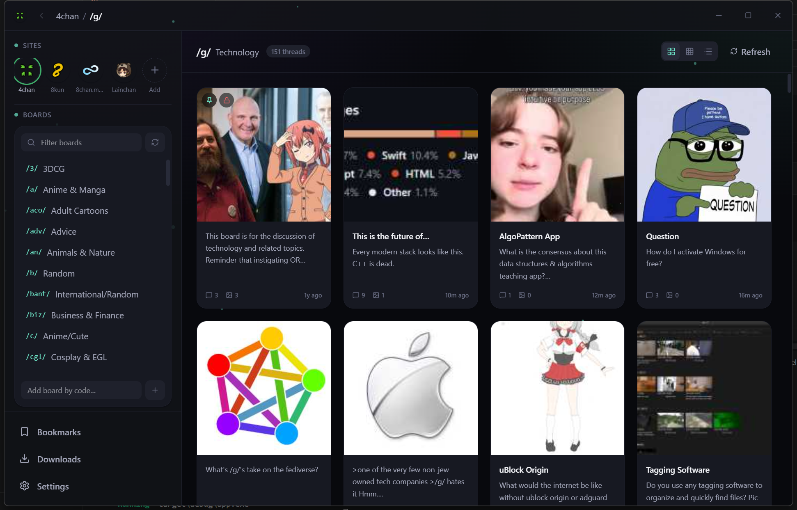
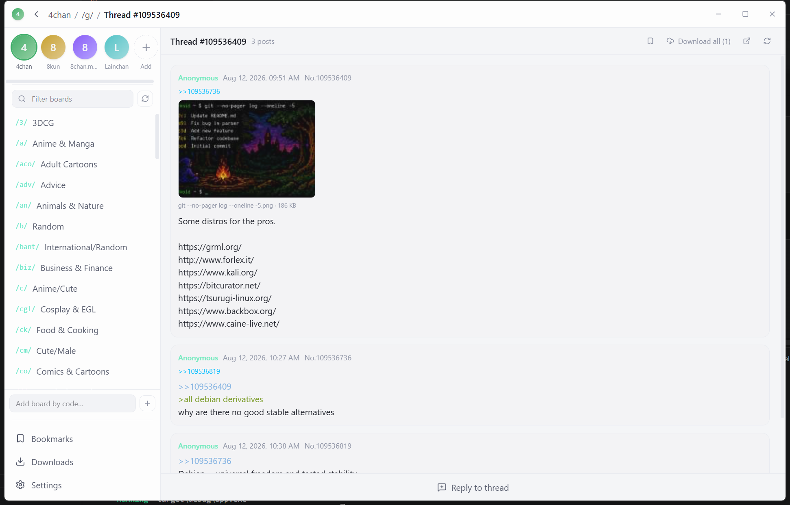
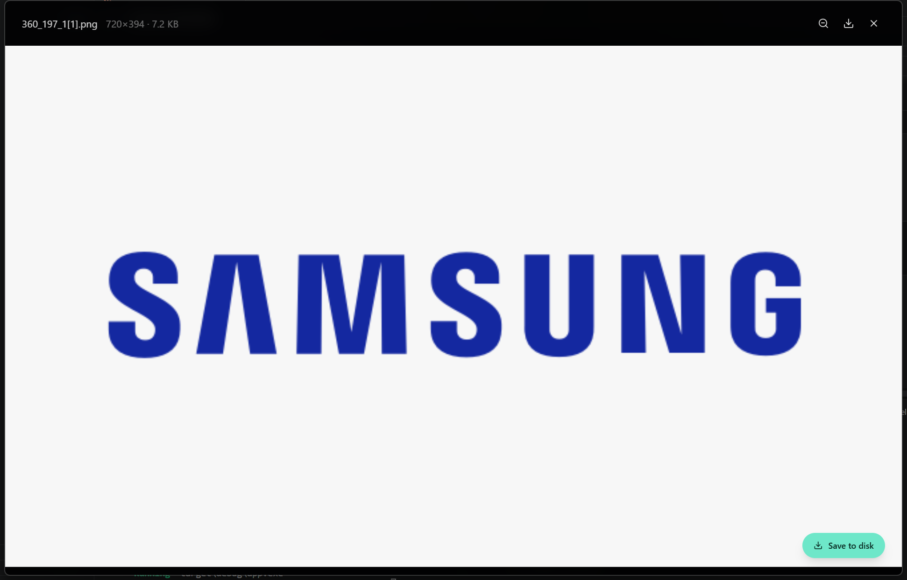
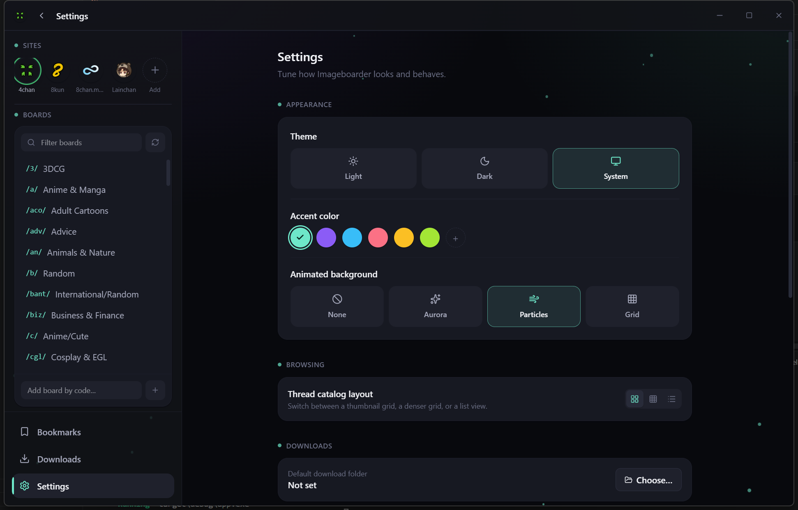

# Imageboarder

A fast, modern desktop viewer for chan-style imageboards (4chan, 8kun, 8chan.moe, Lainchan, and any other 4chan-API-compatible or LynxChan-based site you add), built with Tauri 2, React 19, TypeScript, and Tailwind CSS v4. Runs natively on Windows, macOS, and Linux.



## Features

- **Site switching** — 4chan, 8kun, 8chan.moe and Lainchan presets out of the box, with real site favicons, plus a dialog to add any other 4chan-API-compatible or LynxChan-based imageboard by URL.
- **Board browsing** — live board discovery where the site supports it, with manual board-code entry as a fallback.
- **Catalog & thread views** — switch between a thumbnail grid, a denser compact grid, or a list layout; full-thread reading with greentext, quote links (click to jump), and backlinks.
- **Replying** — post directly to LynxChan-based sites (8kun, 8chan.moe) from inside the app; for sites that require a CAPTCHA (like 4chan), the app hands off to your browser to complete verification.
- **Media preview** — full-screen lightbox with zoom, swipe/drag navigation between a post's or thread's files, video playback, and a "play WEBMs muted by default" toggle.
- **Downloads** — save a single file, a post's files, or an entire thread's media to disk, with a live download-manager queue and folder reveal.
- **Bookmarks** — save threads for quick access later, persisted locally.
- **NSFW-aware** — thumbnails on 18+ sites and spoilered files are blurred until tapped, and 18+ sites can be hidden from the switcher entirely — both toggleable in settings.
- **Theming** — light, dark, or system theme, six accent color presets, and animated background themes (Aurora, Particles, Grid, or none) that carry through the custom titlebar too.
- **First-time setup wizard** — a guided onboarding flow to configure appearance and content preferences on first launch, replayable any time from Settings.

Requests to imageboard APIs are made from the Rust side (via `tauri-plugin-http`), so the app isn't limited by browser CORS restrictions the way a website would be.

## Screenshots

| Catalog | Thread |
|---|---|
|  |  |

| Media lightbox | Settings |
|---|---|
|  |  |

## Install

Pre-built binaries are published on the [Releases](https://github.com/niruxx/imageboarder/releases) page for each tagged version:

- **Windows** — download the `.msi` or `.exe` (NSIS) installer and run it.
- **macOS** — download the `.dmg`, open it, and drag Imageboarder into `Applications`. The app isn't notarized/signed, so the first launch requires right-click → **Open** (or allow it under System Settings → Privacy & Security).
- **Linux** — download whichever fits your distro: `.deb` (Debian/Ubuntu), `.rpm` (Fedora/openSUSE), or the `.AppImage` (works on most distros — make it executable with `chmod +x` and run it).

> No releases have been published yet? Build from source using the instructions below.

## Releases

Versioned builds and changelogs live under [GitHub Releases](https://github.com/niruxx/imageboarder/releases). Each release includes installers for all three platforms, built via `tauri build` in CI (or locally per the instructions below).

## Compile from source

### Requirements (all platforms)

- [Node.js](https://nodejs.org/) 20+
- [Rust](https://www.rust-lang.org/tools/install) (stable toolchain)
- The platform-specific Tauri prerequisites below (also documented at [v2.tauri.app/start/prerequisites](https://v2.tauri.app/start/prerequisites/))

Clone the repo and install JS dependencies first, on every platform:

```bash
git clone https://github.com/niruxx/imageboarder.git
cd imageboarder
npm install
```

### Windows

1. Install [Microsoft Visual Studio C++ Build Tools](https://visualstudio.microsoft.com/visual-cpp-build-tools/) (the "Desktop development with C++" workload).
2. Install the [Rust toolchain](https://www.rust-lang.org/tools/install) (`rustup-init.exe`, default MSVC target).
3. WebView2 comes preinstalled on modern Windows 10/11; if missing, install the [Evergreen Runtime](https://developer.microsoft.com/microsoft-edge/webview2/).
4. Build:

   ```powershell
   npm run tauri build
   ```

   This produces `.msi` and `.exe` (NSIS) installers under `src-tauri/target/release/bundle/`.

### macOS

1. Install Xcode Command Line Tools:

   ```bash
   xcode-select --install
   ```

2. Install [Rust](https://www.rust-lang.org/tools/install) via `rustup`.
3. Build:

   ```bash
   npm run tauri build
   ```

   This produces a `.app` bundle and a `.dmg` under `src-tauri/target/release/bundle/`. To target both Intel and Apple Silicon, add the other target once (`rustup target add x86_64-apple-darwin` or `aarch64-apple-darwin`) and build with `npm run tauri build -- --target universal-apple-darwin`.

### Linux

1. Install the native dependencies for your distro. For Debian/Ubuntu:

   ```bash
   sudo apt update
   sudo apt install -y libwebkit2gtk-4.1-dev build-essential curl wget file \
     libxdo-dev libssl-dev libayatana-appindicator3-dev librsvg2-dev
   ```

   For Fedora:

   ```bash
   sudo dnf install webkit2gtk4.1-devel openssl-devel curl wget file \
     libappindicator-gtk3-devel librsvg2-devel
   sudo dnf group install "C Development Tools and Libraries"
   ```

   For Arch:

   ```bash
   sudo pacman -S --needed webkit2gtk-4.1 base-devel curl wget file \
     openssl appmenu-gtk-module gtk3 libappindicator-gtk3 librsvg
   ```

2. Install [Rust](https://www.rust-lang.org/tools/install) via `rustup`.
3. Build:

   ```bash
   npm run tauri build
   ```

   This produces `.deb`, `.rpm`, and `.AppImage` bundles under `src-tauri/target/release/bundle/`.

## Development

```bash
npm install
npm run tauri dev
```

---

- niruxxdaboi -
